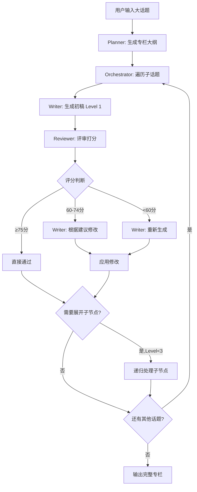

> 构建一个“专栏编写”作家Agent系统。它能针对一个大话题规划一整个专栏的各个子话题，然后对每个子话题展开文章的撰写；而子话题文章中的各个小节也需要按照统一的提示词要求进行递归展开（至多3层），整个撰写过程就像一种树形结构。其中评审Agent不是直接给出"评审未通过"并“重试”，而是应该给出评审结果后对写作Agent提出修改建议，把原文和评审意见、建议还给写作Agent修改，这个过程1次即可

# 专栏编写 Agent 系统完整设计方案

## 目录
- [一、系统概述](#一系统概述)
- [二、系统架构设计](#二系统架构设计)
- [三、核心 Agent 提示词设计](#三核心-agent-提示词设计)
- [四、完整代码实现](#四完整代码实现)
- [五、进阶优化方案](#五进阶优化方案)
- [六、使用示例](#六使用示例)

---

## 一、系统概述

### 1.1 系统目标

构建一个智能化的专栏写作系统，能够：
- 针对大话题自动规划完整的专栏结构
- 按树形结构递归展开各个子话题
- 支持3层深度的内容展开（子话题 → 小节 → 细节）
- 通过评审-修改机制保证内容质量

### 1.2 核心特性

- **树形递归写作**：自顶向下逐层展开内容
- **智能评审机制**：评分 + 详细反馈 + 修改建议
- **一次修改策略**：避免反复重试，提高效率

### 1.3 工作流程图



---

## 二、系统架构设计

### 2.1 Agent 角色划分

```
专栏编写系统 (Column Writing System)
│
├── 主控 Agent (Orchestrator)
│   ├── 负责整体流程控制
│   ├── 管理各个 Agent 的协调
│   └── 处理递归逻辑
│
├── 规划 Agent (Planner)
│   ├── 分析大话题
│   ├── 生成专栏大纲
│   └── 规划子话题结构
│
├── 写作 Agent (Writer)
│   ├── 生成初稿
│   ├── 根据评审修改内容
│   └── 处理重写任务
│
└── 评审 Agent (Reviewer)
    ├── 评估内容质量
    ├── 打分并分级
    └── 提供详细修改建议
```

### 2.2 数据结构设计

```python
from typing import List, Dict, Any, Optional
from dataclasses import dataclass, field
from enum import Enum

class ContentLevel(Enum):
    """内容层级"""
    TOPIC = 1      # 子话题层级
    SECTION = 2    # 小节层级
    DETAIL = 3     # 细节层级

@dataclass
class ContentNode:
    """内容树节点"""
    id: str                                    # 节点唯一标识
    title: str                                 # 节点标题
    level: ContentLevel                        # 内容层级
    description: str                           # 节点描述
    content: Optional[str] = None              # 实际内容（markdown）
    children: List['ContentNode'] = field(default_factory=list)  # 子节点列表
    metadata: Dict[str, Any] = field(default_factory=dict)       # 元数据
    revision_history: List[Dict[str, Any]] = field(default_factory=list)  # 修改历史

@dataclass  
class ReviewResult:
    """评审结果"""
    score: int                                 # 总分 (0-100)
    grade: str                                 # 评级（优秀/良好/需改进/不合格）
    dimension_scores: Dict[str, int]           # 各维度得分
    strengths: List[str]                       # 优点列表
    issues: List[Dict[str, str]]               # 问题列表
    revision_plan: Dict[str, Any]              # 修改计划
    needs_revision: bool                       # 是否需要修改

@dataclass
class ColumnPlan:
    """专栏规划"""
    column_title: str                          # 专栏标题
    column_description: str                    # 专栏描述
    target_audience: str                       # 目标读者
    topics: List[Dict[str, Any]]               # 子话题列表
```

### 2.3 质量控制策略

```python
class QualityControl:
    """质量控制标准"""
    
    APPROVAL_THRESHOLD = 75    # 直接通过分数线
    REVISION_THRESHOLD = 60    # 修改分数线（低于此分数重写）
    MAX_DEPTH = 3             # 最大递归深度
    
    WORD_COUNT_BY_LEVEL = {
        1: 2500,  # Level 1: 子话题 2500字
        2: 600,   # Level 2: 小节 600字
        3: 400    # Level 3: 细节 400字
    }
    
    WORD_COUNT_TOLERANCE = 0.1  # 字数允许误差 ±10%
```

---

## 三、核心 Agent 提示词设计

### 3.1 规划 Agent (Planner)

```python
PLANNER_PROMPT = """
你是一位经验丰富的专栏策划专家。你的任务是将一个大话题拆解为结构清晰的专栏大纲。

## 任务要求
- 输入：大话题主题
- 输出：JSON格式的专栏大纲

## 输出格式
```json
{
  "column_title": "专栏总标题",
  "column_description": "专栏简介（100-200字）",
  "target_audience": "目标读者群体",
  "topics": [
    {
      "id": "topic_001",
      "title": "子话题标题",
      "description": "子话题简介（50-100字）",
      "estimated_words": 2500,
      "key_points": ["要点1", "要点2", "要点3"],
      "prerequisites": ["前置知识1", "前置知识2"]
    }
  ]
}
```

## 规划原则

### 1. 数量控制
- 子话题数量：5-10个
- 每个话题相对独立，可单独阅读
- 总体覆盖主题的完整知识体系

### 2. 逻辑结构
- **递进式**：从基础到高级，从理论到实践
- **关联性**：前后话题有逻辑联系，形成知识链
- **完整性**：涵盖主题的各个重要方面

### 3. 读者导向
- 明确目标读者的知识水平
- 设置合理的学习曲线
- 每个话题都有明确的学习目标

### 4. 实用性
- 理论与实践结合
- 包含实际应用场景
- 提供可操作的知识和技能

## 话题规划检查清单
- [ ] 是否覆盖了主题的核心概念？
- [ ] 是否包含实践应用内容？
- [ ] 话题之间的顺序是否合理？
- [ ] 是否适合目标读者群体？
- [ ] 每个话题的范围是否适中？

现在，请为以下话题规划专栏：

**主题**: {topic}

请输出完整的JSON格式专栏大纲。
"""
```

### 3.2 写作 Agent (Writer) - 初稿生成

```python
WRITER_PROMPT = """
你是一位专业的内容创作者。你需要按照树形结构递归地撰写文章内容。

## 当前写作任务
- **层级**: Level {level}/3
- **话题**: {topic_title}
- **描述**: {description}
- **要求字数**: {word_count} 字（允许误差±10%）
- **上下文**: 
{context}

## 写作要求

### 内容结构
{structure_requirements}

### 风格要求
1. **语言风格**
   - 清晰、专业但易懂
   - 避免过度技术化的术语堆砌
   - 使用类比和比喻帮助理解

2. **段落组织**
   - 每段3-5句话
   - 主题句清晰
   - 段落间过渡自然

3. **举例说明**
   - 每个关键概念配合实例
   - 示例要具体、可操作
   - 代码示例要完整可运行

4. **逻辑连贯**
   - 先总后分
   - 循序渐进
   - 前后呼应

## 递归展开规则

### Level {level} 的展开策略：

**Level 1 (子话题)**:
- 必须规划 3-5 个 subsections
- 每个 subsection 是一个可独立展开的小主题
- subsections 之间有逻辑顺序

**Level 2 (小节)**:
- 根据内容复杂度决定是否展开
- 如果某个概念需要深入讲解，设置 subsections
- 建议 0-2 个 subsections

**Level 3 (细节)**:
- 不再展开（needs_expansion = false）
- 专注于具体内容的详细说明

## 输出格式

```json
{
  "title": "章节标题",
  "level": {level},
  "content": "正文内容（markdown格式）",
  "word_count": 实际字数,
  "needs_expansion": true/false,
  "subsections": [
    {
      "id": "section_1_1",
      "title": "小节标题",
      "description": "小节简介（一句话说明内容）",
      "estimated_words": 600,
      "key_points": ["要点1", "要点2", "要点3"],
      "complexity": "high/medium/low"
    }
  ],
  "metadata": {
    "keywords": ["关键词1", "关键词2", "关键词3"],
    "references": ["引用来源1", "引用来源2"],
    "code_examples": ["示例1描述", "示例2描述"],
    "difficulty": "beginner/intermediate/advanced"
  }
}
```

## 层级结构详细要求

### Level 1 (子话题级别) - 2500字左右

**结构**:
```
1. 引言 (200-300字)
   - 话题背景
   - 重要性说明
   - 本文概览（告诉读者将学到什么）

2. 主体内容 (1800-2000字)
   分为3-5个小节，每节400-600字
   - 小节1: [概念介绍]
   - 小节2: [深入分析]
   - 小节3: [实践应用]
   - 小节4: [进阶技巧]
   - 小节5: [注意事项]

3. 实践案例 (300-400字)
   - 完整的应用示例
   - 代码实现（如适用）
   - 运行结果说明

4. 总结与展望 (200字)
   - 核心要点回顾
   - 延伸学习方向
   - 与后续内容的联系
```

**要点**:
- 必须包含 subsections 字段
- 每个 subsection 要有明确的学习目标
- 内容要自成体系，可独立阅读

### Level 2 (小节级别) - 600字左右

**结构**:
```
1. 小节引入 (100字)
   - 承接上文
   - 说明本节主题

2. 核心内容 (400字)
   - 详细论述核心概念
   - 至少包含1个具体例子
   - 对比说明（如适用）
   - 图表辅助（如适用）

3. 小结 (100字)
   - 本节要点总结
   - 引导到下一部分
```

**要点**:
- 如果内容复杂度高（complexity: high），设置 subsections
- 专注于某个具体主题的深入讲解
- 理论与实践结合

### Level 3 (细节级别) - 400字左右

**结构**:
```
1. 具体说明 (250-300字)
   - 深入某个特定点
   - 详细的操作步骤或原理解释

2. 示例或补充 (100-150字)
   - 代码片段
   - 具体实例
   - 注意事项
```

**要点**:
- needs_expansion = false（不再展开）
- 内容要具体、可操作
- 避免过度延伸

## 质量自检

在生成内容前，请确认：
- [ ] 是否覆盖了规划的所有要点？
- [ ] 概念解释是否清晰易懂？
- [ ] 是否包含足够的例子？
- [ ] 逻辑是否连贯？
- [ ] 字数是否符合要求？
- [ ] 如需展开，subsections 是否规划合理？

{additional_requirements}

现在开始撰写，输出完整的JSON格式内容。
"""
```

### 3.3 评审 Agent (Reviewer)

```python
REVIEWER_PROMPT = """
你是一位严格而专业的内容评审专家。你的任务是评审文章质量，并提供详细的、可操作的修改建议。

## 评审维度与标准

### 1. 内容质量 (40分)

**准确性 (10分)**
- 信息是否准确可靠
- 概念解释是否正确
- 技术细节是否精确

**完整性 (10分)**
- 是否覆盖了规划的所有要点
- 逻辑链条是否完整
- 是否遗漏重要内容

**深度 (10分)**
- 分析是否深入透彻
- 是否触及本质
- 是否有深刻洞察

**原创性 (10分)**
- 观点是否有独特见解
- 表达是否有新意
- 是否避免陈词滥调

### 2. 结构逻辑 (30分)

**层次清晰 (10分)**
- 段落层次是否分明
- 小节划分是否合理
- 重点是否突出

**逻辑连贯 (10分)**
- 论述前后是否连贯
- 因果关系是否清晰
- 推理是否严密

**过渡自然 (10分)**
- 段落间衔接是否流畅
- 章节过渡是否自然
- 是否有跳跃感

### 3. 语言表达 (20分)

**易读性 (8分)**
- 是否通俗易懂
- 句式是否简洁
- 是否避免冗余

**专业性 (6分)**
- 术语使用是否恰当
- 表达是否专业规范
- 是否符合领域习惯

**准确性 (6分)**
- 用词是否精确
- 表达是否清晰明确
- 是否有歧义

### 4. 格式规范 (10分)

**字数达标 (4分)**
- 是否在目标字数±10%范围内

**格式正确 (3分)**
- Markdown 格式是否规范
- 代码块是否正确标注
- 列表是否格式统一

**排版美观 (3分)**
- 段落长度是否适中
- 空行使用是否合理
- 整体是否美观

## 评分标准

- **优秀** (85-100分): 内容扎实，表达优秀，无需修改或仅需微调
- **良好** (75-84分): 整体不错，存在可改进之处，需要针对性优化
- **需改进** (60-74分): 存在明显问题，需要重点修改
- **不合格** (<60分): 严重偏离要求，需要大幅改写或重新生成

## 评审输入

```json
{
  "content": "待评审内容（markdown格式）",
  "level": 层级 (1/2/3),
  "requirements": {
    "word_count": 目标字数,
    "key_points": ["要点1", "要点2"],
    "structure": "结构要求"
  }
}
```

## 评审输出格式

请严格按照以下JSON格式输出评审结果：

```json
{
  "score": 78,
  "grade": "良好",
  "dimension_scores": {
    "content_quality": 32,
    "structure": 24,
    "language": 15,
    "format": 7
  },
  "detailed_feedback": {
    "strengths": [
      "概念解释清晰，使用了贴切的类比",
      "代码示例完整可运行，注释详细",
      "结构层次分明，逻辑严密"
    ],
    "issues": [
      {
        "category": "内容质量",
        "severity": "中等",
        "location": "第2段（协程概念部分）",
        "problem": "对协程的解释偏理论，缺少与传统函数的对比",
        "suggestion": "建议添加一个对比表格，展示协程与普通函数在执行方式、状态保持、调用方式等方面的区别。可以用200字左右进行对比说明。",
        "impact": "影响读者对核心概念的理解"
      },
      {
        "category": "结构逻辑",
        "severity": "轻微",
        "location": "第3段到第4段过渡",
        "problem": "从事件循环介绍直接跳转到async/await语法，过渡突兀",
        "suggestion": "在第3段末尾添加过渡句，例如：'理解了事件循环的机制后，我们来看Python如何通过async/await语法来简化异步编程。'",
        "impact": "轻微影响阅读流畅度"
      },
      {
        "category": "内容完整性",
        "severity": "严重",
        "location": "实践案例部分（第5段）",
        "problem": "承诺提供完整案例，但只有代码片段，缺少场景说明和运行结果",
        "suggestion": "补充以下内容：\n1. 案例背景说明（100字）：这个例子解决什么问题\n2. 完整代码（当前只有部分）\n3. 运行结果展示（50字）\n4. 关键代码解释（100字）",
        "impact": "严重影响实践指导价值"
      }
    ]
  },
  "revision_plan": {
    "priority_changes": [
      {
        "section": "第2段 - 协程概念",
        "action": "补充内容",
        "detail": "在当前解释后，添加对比表格或对比段落（200字），对比协程与普通函数的关键区别。可以从以下维度对比：执行方式（顺序vs可暂停）、状态保持（是vs否）、调用方式（call vs await）、适用场景等。",
        "estimated_effort": "补充约200字，难度：中"
      },
      {
        "section": "第5段 - 实践案例",
        "action": "重写并扩充",
        "detail": "将当前的代码片段扩展为完整案例：\n1. 添加案例背景（100字）：说明这是一个什么场景，为什么需要异步\n2. 提供完整代码（确保可直接运行）\n3. 展示运行结果（50字）\n4. 添加代码解释（100字）：关键语句的作用\n总计需要补充约250-300字",
        "estimated_effort": "补充约300字，难度：中高"
      }
    ],
    "minor_improvements": [
      {
        "section": "第3-4段过渡",
        "action": "添加过渡句",
        "detail": "在第3段末尾添加：'理解了事件循环的工作原理后，接下来我们看看Python如何通过async/await语法来优雅地实现异步编程。'",
        "estimated_effort": "约30字，难度：低"
      },
      {
        "section": "第1段 - 引言",
        "action": "语言优化",
        "detail": "将'异步编程非常重要'改为更具体的表述，如'在处理I/O密集型任务时，异步编程可以将性能提升10-100倍'，用数据支撑重要性。",
        "estimated_effort": "约20字替换，难度：低"
      }
    ]
  },
  "estimated_revision_effort": "中等 - 需要补充约500字内容，重写1个部分，调整2-3处过渡",
  "needs_revision": true,
  "reviewer_notes": "文章整体框架清晰，概念解释较为准确，主要问题在于实践案例不完整和部分过渡不够流畅。建议重点补充实践案例部分，这是Level 1文章的重要组成部分。"
}
```

## 评审原则

### 1. 具体性原则
- 明确指出问题所在的具体段落或位置
- 用具体例子说明问题
- 避免"整体不错但还需改进"这类模糊评价

### 2. 建设性原则
- 每个问题都要提供可操作的解决方案
- 说明具体怎么改、改成什么样
- 提供参考示例或方向

### 3. 平衡性原则
- 既指出不足，也肯定优点
- 根据问题严重程度分级
- 提供优先级指导

### 4. 层级适配原则
- Level 1 (子话题): 评审最严格，重点关注完整性和深度
- Level 2 (小节): 平衡严格度，关注针对性和清晰度
- Level 3 (细节): 相对宽松，关注准确性和具体性

### 5. 客观性原则
- 基于明确的评分标准打分
- 避免主观偏好影响评价
- 确保评分与反馈一致

## 当前评审任务

**层级**: Level {level}
**目标字数**: {requirements[word_count]}
**关键要点**: {requirements[key_points]}
**结构要求**: {requirements[structure]}

**待评审内容**:
---
{content}
---

请严格按照上述标准进行评审，输出完整的JSON格式评审结果。记住：你的评审意见将直接用于指导修改，所以必须具体、可操作、有建设性。
"""
```

### 3.4 修改 Agent (Revision Writer)

```python
REVISION_PROMPT = """
你是一位专业的内容创作者。现在需要根据编辑的评审意见修改你的文章。

## 原始内容

{original_content}

## 评审结果

**评分**: {score}/100 ({grade})

**主要优点**:
{strengths}

**存在问题**:
{issues}

**评审专家的额外建议**:
{reviewer_notes}

## 修改计划

### 优先修改项 (Priority Changes)
必须完成的修改，直接影响内容质量：

{priority_changes}

### 次要优化项 (Minor Improvements)
锦上添花的优化：

{minor_improvements}

## 修改要求

### 1. 基本原则
- **保持优点**: 评审中提到的优点要保留并发扬
- **针对性改进**: 严格按照"优先修改项"进行改写
- **整体连贯**: 修改后要确保全文逻辑流畅
- **风格统一**: 新增内容要与原文风格一致

### 2. 字数控制
- 目标字数范围: {word_count_range}
- 当前字数: {current_word_count}
- 需要调整: {word_count_adjustment}

### 3. 修改标注
在修改的段落后使用如下标注（供审核）：
```markdown
<!-- 已修改: [修改类型] - [简要说明] -->
```

示例：
```markdown
这是修改后的段落内容...
<!-- 已修改: 补充内容 - 添加了协程与函数的对比说明 -->
```

## 修改策略指南

### 补充内容 (Add Content)
- 确定插入位置
- 保持与上下文的连贯性
- 拓展背景和演进

### 重写部分 (Rewrite)
- 保留核心信息
- 改善表达方式
- 增强逻辑性和可读性

### 优化语言 (Polish)
- 使用更精确的用词
- 简化复杂句式
- 增加初学者/外行可读性

### 调整结构 (Restructure)
- 重新组织段落顺序
- 改善内容分组
- 优化标题层级

## 输出格式

```json
{
  "revised_content": "修改后的完整内容（markdown格式，包含修改标注）",
  "revision_summary": {
    "major_changes": [
      "在第2段补充了协程与普通函数的对比表格（200字）",
      "重写了第5段实践案例，添加了场景说明、完整代码和运行结果（300字）",
      "调整了第3-4段过渡，增强连贯性"
    ],
    "minor_changes": [
      "优化了第1段的表述，使用具体数据替代'非常重要'",
      "统一了代码块的注释风格",
      "修正了2处术语表达"
    ],
    "preserved_strengths": [
      "保持了原文清晰的概念解释方式",
      "保留了有效的类比和示例"
    ]
  },
  "word_count": 修改后的实际字数,
  "word_count_change": "+250字 (补充了案例说明和对比内容)",
  "changes_made": {
    "sections_rewritten": ["第5段 - 实践案例"],
    "sections_expanded": ["第2段 - 协程概念"],
    "sections_polished": ["第1段 - 引言", "第3段 - 事件循环"],
    "transitions_improved": ["第3-4段之间"],
    "minor_fixes": ["术语统一", "代码格式"]
  },
  "quality_improvements": {
    "content_completeness": "补充了缺失的案例说明和对比内容",
    "logical_flow": "改善了段落间过渡",
    "readability": "优化了部分表述，增强可读性",
    "technical_accuracy": "统一了术语使用"
  }
}
```

## 修改自检清单

在提交修改前，请确认：

- [ ] 所有"优先修改项"都已完成
- [ ] 新增内容与原文风格一致
- [ ] 修改后的内容逻辑连贯
- [ ] 字数在目标范围内
- [ ] 所有修改都有标注
- [ ] 保留了原文的优点
- [ ] 修改解决了评审指出的问题
- [ ] 全文通读流畅

## 注意事项

1. **不要过度修改**
   - 只修改评审指出的问题
   - 如果某段评审认为很好，就不要动
   - 避免"为了改而改"

2. **保持原创性**
   - 补充的例子要真实、准确
   - 不要编造数据或事实
   - 技术内容要确保正确性

3. **处理冲突建议**
   - 如果修改建议之间有矛盾，优先保证内容质量
   - 如果某个建议不合理，可以说明原因并采用更好的方案
   - 记录在 revision_summary 中

4. **控制修改范围**
   - 重点修改"严重"和"中等"问题
   - "轻微"问题根据时间和篇幅酌情处理
   - 确保核心问题得到解决

现在开始修改，输出完整的修改后内容和详细的修改说明。
"""
```

---

## 四、完整代码实现

### 4.1 核心类定义

```python
import json
import asyncio
from typing import List, Dict, Any, Optional
from dataclasses import dataclass, field
from enum import Enum
from datetime import datetime

class ContentLevel(Enum):
    """内容层级枚举"""
    TOPIC = 1      # 子话题
    SECTION = 2    # 小节
    DETAIL = 3     # 细节

@dataclass
class ContentNode:
    """内容树节点"""
    id: str
    title: str
    level: ContentLevel
    description: str
    content: Optional[str] = None
    children: List['ContentNode'] = field(default_factory=list)
    metadata: Dict[str, Any] = field(default_factory=dict)
    revision_history: List[Dict[str, Any]] = field(default_factory=list)
    
    def add_child(self, child: 'ContentNode'):
        """添加子节点"""
        self.children.append(child)
    
    def get_all_nodes(self) -> List['ContentNode']:
        """获取所有节点（深度优先）"""
        nodes = [self]
        for child in self.children:
            nodes.extend(child.get_all_nodes())
        return nodes
    
    def count_words(self) -> int:
        """统计节点及其子节点的总字数"""
        total = len(self.content) if self.content else 0
        for child in self.children:
            total += child.count_words()
        return total

@dataclass
class ReviewResult:
    """评审结果"""
    score: int
    grade: str
    dimension_scores: Dict[str, int]
    detailed_feedback: Dict[str, Any]
    revision_plan: Dict[str, Any]
    needs_revision: bool
    estimated_effort: str
    
    @classmethod
    def from_dict(cls, data: Dict[str, Any]) -> 'ReviewResult':
        """从字典创建评审结果"""
        return cls(
            score=data['score'],
            grade=data['grade'],
            dimension_scores=data['dimension_scores'],
            detailed_feedback=data['detailed_feedback'],
            revision_plan=data['revision_plan'],
            needs_revision=data['needs_revision'],
            estimated_effort=data.get('estimated_revision_effort', '未知')
        )

@dataclass
class ColumnPlan:
    """专栏规划"""
    column_title: str
    column_description: str
    target_audience: str
    topics: List[Dict[str, Any]]
    
    @classmethod
    def from_dict(cls, data: Dict[str, Any]) -> 'ColumnPlan':
        """从字典创建专栏规划"""
        return cls(
            column_title=data['column_title'],
            column_description=data['column_description'],
            target_audience=data['target_audience'],
            topics=data['topics']
        )
    
    def get_topic_count(self) -> int:
        """获取话题数量"""
        return len(self.topics)
```

### 4.2 主系统实现

```python
class ColumnWriterAgent:
    """专栏写作智能体系统"""
    
    # 质量控制常量
    APPROVAL_THRESHOLD = 75    # 直接通过分数线
    REVISION_THRESHOLD = 60    # 修改分数线
    MAX_DEPTH = 3             # 最大递归深度
    
    WORD_COUNT_BY_LEVEL = {
        1: 2500,
        2: 600,
        3: 400
    }
    
    def __init__(self, llm_client, config: Optional[Dict[str, Any]] = None):
        """
        初始化写作系统
        
        Args:
            llm_client: LLM客户端实例
            config: 配置字典，可选参数：
                - approval_threshold: 直接通过分数线（默认75）
                - revision_threshold: 修改分数线（默认60）
                - max_depth: 最大递归深度（默认3）
                - enable_parallel: 是否启用并行处理（默认False）
        """
        self.llm = llm_client
        
        # 加载配置
        config = config or {}
        self.approval_threshold = config.get('approval_threshold', self.APPROVAL_THRESHOLD)
        self.revision_threshold = config.get('revision_threshold', self.REVISION_THRESHOLD)
        self.max_depth = config.get('max_depth', self.MAX_DEPTH)
        self.enable_parallel = config.get('enable_parallel', False)
        
        # 统计信息
        self.stats = {
            'total_generations': 0,
            'total_reviews': 0,
            'total_revisions': 0,
            'total_rewrites': 0,
            'start_time': None,
            'end_time': None
        }
    
    async def create_column(self, main_topic: str) -> Dict[str, Any]:
        """
        创建完整专栏
        
        Args:
            main_topic: 专栏主题
            
        Returns:
            包含专栏完整信息的字典
        """
        self.stats['start_time'] = datetime.now()
        
        print(f"\n{'='*70}")
        print(f"🎯 开始创建专栏：{main_topic}")
        print(f"{'='*70}\n")
        
        # Step 1: 规划专栏结构
        print("📋 第一步：规划专栏结构")
        print("-" * 70)
        column_plan = await self.plan_column(main_topic)
        print(f"✅ 专栏规划完成")
        print(f"   标题：{column_plan.column_title}")
        print(f"   话题数：{column_plan.get_topic_count()} 个")
        print(f"   目标读者：{column_plan.target_audience}\n")
        
        # Step 2: 为每个子话题创建内容树
        print("✍️  第二步：撰写专栏文章")
        print("-" * 70)
        
        if self.enable_parallel:
            content_trees = await self._write_topics_parallel(column_plan)
        else:
            content_trees = await self._write_topics_sequential(column_plan)
        
        # Step 3: 组装完整专栏
        print("\n📦 第三步：组装专栏内容")
        print("-" * 70)
        full_column = self.assemble_column(column_plan, content_trees)
        
        self.stats['end_time'] = datetime.now()
        duration = (self.stats['end_time'] - self.stats['start_time']).total_seconds()
        
        print(f"\n{'='*70}")
        print(f"✅ 专栏创建完成！耗时 {duration:.1f} 秒")
        print(f"{'='*70}\n")
        
        # 添加统计信息
        full_column['creation_stats'] = self.stats
        
        return full_column
    
    async def _write_topics_sequential(self, column_plan: ColumnPlan) -> List[ContentNode]:
        """顺序写作各个话题"""
        content_trees = []
        for idx, topic in enumerate(column_plan.topics, 1):
            print(f"\n{'─'*70}")
            print(f"📝 正在写作第 {idx}/{column_plan.get_topic_count()} 个话题")
            print(f"   话题：{topic['title']}")
            print(f"{'─'*70}")
            
            tree = await self.write_topic_tree(topic, column_plan)
            content_trees.append(tree)
            
            # 显示进度
            progress = idx / column_plan.get_topic_count() * 100
            print(f"\n📊 总体进度：{progress:.0f}% ({idx}/{column_plan.get_topic_count()})")
        
        return content_trees
    
    async def _write_topics_parallel(self, column_plan: ColumnPlan) -> List[ContentNode]:
        """并行写作各个话题"""
        print("⚡ 启用并行模式")
        tasks = [
            self.write_topic_tree(topic, column_plan)
            for topic in column_plan.topics
        ]
        content_trees = await asyncio.gather(*tasks)
        return content_trees
    
    async def plan_column(self, main_topic: str) -> ColumnPlan:
        """
        规划专栏大纲
        
        Args:
            main_topic: 专栏主题
            
        Returns:
            ColumnPlan实例
        """
        prompt = PLANNER_PROMPT.format(topic=main_topic)
        response = await self.llm.generate(prompt)
        plan_data = json.loads(response)
        return ColumnPlan.from_dict(plan_data)
    
    async def write_topic_tree(
        self, 
        topic: Dict[str, Any], 
        column_context: ColumnPlan
    ) -> ContentNode:
        """
        递归写作话题树
        
        Args:
            topic: 话题信息
            column_context: 专栏上下文
            
        Returns:
            完整的内容树根节点
        """
        root = ContentNode(
            id=topic['id'],
            title=topic['title'],
            level=ContentLevel.TOPIC,
            description=topic['description']
        )
        
        # 递归写作
        context = {
            'column_title': column_context.column_title,
            'column_description': column_context.column_description,
            'target_audience': column_context.target_audience,
            'current_topic': topic
        }
        
        await self._recursive_write(root, context, level=1)
        return root
    
    async def _recursive_write(
        self, 
        node: ContentNode, 
        context: Dict[str, Any], 
        level: int
    ):
        """
        递归写作核心逻辑
        
        Args:
            node: 当前节点
            context: 写作上下文
            level: 当前层级
        """
        if level > self.max_depth:
            indent = "  " * level
            print(f"{indent}⚠️  达到最大深度 {self.max_depth}，停止展开")
            return
        
        indent = "  " * level
        print(f"\n{indent}{'┈'*40}")
        print(f"{indent}📄 Level {level}: {node.title}")
        print(f"{indent}{'┈'*40}")
        
        # Step 1: 生成初稿
        print(f"{indent}✍️  生成初稿...")
        content_data = await self._generate_content(node, context, level)
        self.stats['total_generations'] += 1
        
        original_content = content_data['content']
        word_count = content_data.get('word_count', len(original_content))
        print(f"{indent}   字数：{word_count}")
        
        # Step 2: 评审
        print(f"{indent}🔍 评审中...")
        review_result = await self._review_content(content_data, level, node.description, context)
        self.stats['total_reviews'] += 1
        
        score = review_result.score
        grade = review_result.grade
        print(f"{indent}📊 评审结果：{score}分 ({grade})")
        
        # Step 3: 根据评分决定处理策略
        if score >= self.approval_threshold:
            # 直接通过
            print(f"{indent}✅ 内容优秀，直接通过！")
            await self._handle_approval(node, content_data, review_result)
            
        elif score >= self.revision_threshold:
            # 需要修改
            print(f"{indent}📝 需要修改，正在优化...")
            await self._handle_revision(node, original_content, content_data, review_result, level, context, indent)
            
        else:
            # 重新生成
            print(f"{indent}⚠️  评分过低 ({score}分)，重新生成...")
            await self._handle_rewrite(node, content_data, review_result, context, level, indent)
        
        # Step 4: 处理子节点
        await self._process_children(node, content_data, context, level, indent)
    
    async def _handle_approval(
        self,
        node: ContentNode,
        content_data: Dict[str, Any],
        review_result: ReviewResult
    ):
        """处理直接通过的情况"""
        node.content = content_data['content']
        node.metadata = content_data.get('metadata', {})
        node.metadata.update({
            'review_score': review_result.score,
            'review_grade': review_result.grade,
            'approved': True
        })
    
    async def _handle_revision(
        self,
        node: ContentNode,
        original_content: str,
        content_data: Dict[str, Any],
        review_result: ReviewResult,
        level: int,
        context: Dict[str, Any],
        indent: str
    ):
        """处理需要修改的情况"""
        # 显示主要问题
        issues = review_result.detailed_feedback['issues']
        print(f"{indent}💡 发现 {len(issues)} 个问题：")
        for issue in issues[:3]:  # 只显示前3个
            severity_icon = {"严重": "🔴", "中等": "🟡", "轻微": "🟢"}.get(issue['severity'], "⚪")
            print(f"{indent}   {severity_icon} {issue['location']}: {issue['problem'][:50]}...")
        
        # 执行修改
        revised_data = await self._revise_content(
            original_content,
            review_result,
            level,
            context
        )
        self.stats['total_revisions'] += 1
        
        print(f"{indent}✅ 修改完成")
        print(f"{indent}📈 主要修改：")
        for change in revised_data['revision_summary']['major_changes'][:3]:
            print(f"{indent}   ✓ {change[:60]}...")
        
        # 更新节点
        node.content = revised_data['revised_content']
        node.metadata = content_data.get('metadata', {})
        node.metadata.update({
            'review_score': review_result.score,
            'review_grade': review_result.grade,
            'revised': True,
            'revision_summary': revised_data['revision_summary']
        })
        
        # 记录修改历史
        node.revision_history.append({
            'original': original_content,
            'review': review_result.__dict__,
            'revised': revised_data['revised_content'],
            'timestamp': datetime.now().isoformat()
        })
    
    async def _handle_rewrite(
        self,
        node: ContentNode,
        content_data: Dict[str, Any],
        review_result: ReviewResult,
        context: Dict[str, Any],
        level: int,
        indent: str
    ):
        """处理需要重写的情况"""
        print(f"{indent}🔄 正在重新生成...")
        self.stats['total_rewrites'] += 1
        
        # 将评审意见作为额外要求
        additional_requirements = f"""
## 特别注意（根据评审反馈）
评分过低的原因：
{json.dumps(review_result.detailed_feedback['issues'], ensure_ascii=False, indent=2)}

请特别关注以下修改计划：
{json.dumps(review_result.revision_plan, ensure_ascii=False, indent=2)}
"""
        
        content_data = await self._generate_content(
            node,
            context,
            level,
            additional_requirements=additional_requirements
        )
        
        node.content = content_data['content']
        node.metadata = content_data.get('metadata', {})
        node.metadata.update({
            'rewritten': True,
            'original_score': review_result.score
        })
        
        print(f"{indent}✅ 重新生成完成")
    
    async def _process_children(
        self,
        node: ContentNode,
        content_data: Dict[str, Any],
        context: Dict[str, Any],
        level: int,
        indent: str
    ):
        """处理子节点"""
        if content_data.get('needs_expansion') and level < self.max_depth:
            subsections = content_data.get('subsections', [])
            if subsections:
                print(f"{indent}📂 需要展开 {len(subsections)} 个子节点")
                
                for sub_idx, subsection in enumerate(subsections, 1):
                    child = ContentNode(
                        id=subsection['id'],
                        title=subsection['title'],
                        level=ContentLevel(level + 1),
                        description=subsection['description']
                    )
                    node.add_child(child)
                    
                    # 递归写作子节点
                    await self._recursive_write(child, context, level + 1)
    
    async def _generate_content(
        self, 
        node: ContentNode, 
        context: Dict[str, Any], 
        level: int,
        additional_requirements: str = ""
    ) -> Dict[str, Any]:
        """
        生成内容
        
        Args:
            node: 当前节点
            context: 写作上下文
            level: 当前层级
            additional_requirements: 额外要求（用于重写时的改进）
            
        Returns:
            生成的内容数据
        """
        structure_requirements = self._get_structure_requirements(level)
        
        prompt = WRITER_PROMPT.format(
            level=level,
            topic_title=node.title,
            description=node.description,
            word_count=self.WORD_COUNT_BY_LEVEL[level],
            context=json.dumps(context, ensure_ascii=False, indent=2),
            structure_requirements=structure_requirements,
            additional_requirements=additional_requirements
        )
        
        response = await self.llm.generate(prompt)
        content_data = json.loads(response)
        return content_data
    
    async def _review_content(
        self, 
        content_data: Dict[str, Any], 
        level: int,
        description: str,
        context: Dict[str, Any]
    ) -> ReviewResult:
        """
        评审内容
        
        Args:
            content_data: 内容数据
            level: 层级
            description: 内容描述
            context: 上下文
            
        Returns:
            ReviewResult实例
        """
        requirements = {
            'word_count': self.WORD_COUNT_BY_LEVEL[level],
            'key_points': context.get('current_topic', {}).get('key_points', []),
            'structure': self._get_structure_requirements(level)
        }
        
        prompt = REVIEWER_PROMPT.format(
            level=level,
            requirements=requirements,
            content=content_data['content']
        )
        
        response = await self.llm.generate(prompt)
        review_data = json.loads(response)
        return ReviewResult.from_dict(review_data)
    
    async def _revise_content(
        self,
        original_content: str,
        review_result: ReviewResult,
        level: int,
        context: Dict[str, Any]
    ) -> Dict[str, Any]:
        """
        根据评审意见修改内容
        
        Args:
            original_content: 原始内容
            review_result: 评审结果
            level: 层级
            context: 上下文
            
        Returns:
            修改后的内容数据
        """
        # 格式化评审信息
        strengths = "\n".join([f"- {s}" for s in review_result.detailed_feedback['strengths']])
        
        issues = []
        for issue in review_result.detailed_feedback['issues']:
            issues.append(
                f"[{issue['severity']}] {issue['location']}\n"
                f"问题：{issue['problem']}\n"
                f"建议：{issue['suggestion']}\n"
                f"影响：{issue['impact']}"
            )
        issues_text = "\n\n".join(issues)
        
        priority_changes = "\n\n".join([
            f"{i+1}. {change['section']} - {change['action']}\n   {change['detail']}"
            for i, change in enumerate(review_result.revision_plan['priority_changes'])
        ])
        
        minor_improvements = "\n".join([
            f"- {change['section']}: {change['detail']}"
            for change in review_result.revision_plan.get('minor_improvements', [])
        ])
        
        word_count = self.WORD_COUNT_BY_LEVEL[level]
        current_word_count = len(original_content)
        word_count_range = f"{int(word_count * 0.9)}-{int(word_count * 1.1)}"
        
        # 计算字数调整
        if current_word_count < word_count * 0.9:
            word_count_adjustment = f"需要增加约 {int(word_count * 0.9 - current_word_count)} 字"
        elif current_word_count > word_count * 1.1:
            word_count_adjustment = f"需要精简约 {int(current_word_count - word_count * 1.1)} 字"
        else:
            word_count_adjustment = "字数合适，保持当前水平"
        
        reviewer_notes = review_result.__dict__.get('reviewer_notes', '无')
        
        # 生成修改提示
        prompt = REVISION_PROMPT.format(
            original_content=original_content,
            score=review_result.score,
            grade=review_result.grade,
            strengths=strengths,
            issues=issues_text,
            reviewer_notes=reviewer_notes,
            priority_changes=priority_changes,
            minor_improvements=minor_improvements,
            word_count_range=word_count_range,
            current_word_count=current_word_count,
            word_count_adjustment=word_count_adjustment
        )
        
        response = await self.llm.generate(prompt)
        revised_data = json.loads(response)
        return revised_data
    
    def _get_structure_requirements(self, level: int) -> str:
        """获取层级对应的结构要求"""
        requirements = {
            1: """
Level 1 结构（子话题）：
1. 引言（200-300字）：背景介绍、重要性、本文概览
2. 主体内容（1800-2000字）：分3-5个小节，每节400-600字
3. 实践案例（300-400字）：完整的示例代码或应用场景
4. 总结与展望（200字）：要点回顾、延伸思考
            """,
            2: """
Level 2 结构（小节）：
1. 小节引入（100字）：承上启下，说明本节主题
2. 核心内容（400字）：详细论述，至少包含1个具体例子
3. 小结（100字）：本节要点总结
            """,
            3: """
Level 3 结构（细节）：
1. 具体说明（250-300字）：深入某个特定点
2. 示例或补充（100-150字）：代码片段或实例
            """
        }
        return requirements.get(level, requirements[3])
    
    def assemble_column(
        self, 
        plan: ColumnPlan, 
        trees: List[ContentNode]
    ) -> Dict[str, Any]:
        """
        组装完整专栏
        
        Args:
            plan: 专栏规划
            trees: 内容树列表
            
        Returns:
            完整的专栏数据
        """
        articles = []
        
        for tree in trees:
            article_content = self._tree_to_markdown(tree)
            
            articles.append({
                'id': tree.id,
                'title': tree.title,
                'content': article_content,
                'metadata': tree.metadata,
                'has_revisions': len(tree.revision_history) > 0,
                'revision_count': len(tree.revision_history),
                'word_count': tree.count_words()
            })
        
        return {
            'column_info': {
                'title': plan.column_title,
                'description': plan.column_description,
                'target_audience': plan.target_audience,
                'topic_count': plan.get_topic_count()
            },
            'articles': articles,
            'statistics': self._calculate_statistics(trees),
            'quality_report': self._generate_quality_report(trees)
        }
    
    def _tree_to_markdown(self, node: ContentNode, depth: int = 0) -> str:
        """
        将内容树转换为markdown
        
        Args:
            node: 内容节点
            depth: 当前深度（用于标题级别）
            
        Returns:
            markdown格式的内容
        """
        markdown = []
        
        # 标题
        heading_level = "#" * (depth + 1)
        markdown.append(f"{heading_level} {node.title}\n")
        
        # 内容
        if node.content:
            markdown.append(node.content)
            markdown.append("\n")
        
        # 递归处理子节点
        for child in node.children:
            child_md = self._tree_to_markdown(child, depth + 1)
            markdown.append(child_md)
        
        return "\n".join(markdown)
    
    def _calculate_statistics(self, trees: List[ContentNode]) -> Dict[str, Any]:
        """计算统计信息"""
        total_words = 0
        total_nodes = 0
        revised_nodes = 0
        rewritten_nodes = 0
        approved_nodes = 0
        
        def count_tree(node: ContentNode):
            nonlocal total_words, total_nodes, revised_nodes, rewritten_nodes, approved_nodes
            total_nodes += 1
            total_words += len(node.content) if node.content else 0
            
            if node.metadata.get('revised'):
                revised_nodes += 1
            if node.metadata.get('rewritten'):
                rewritten_nodes += 1
            if node.metadata.get('approved'):
                approved_nodes += 1
                
            for child in node.children:
                count_tree(child)
        
        for tree in trees:
            count_tree(tree)
        
        return {
            'total_articles': len(trees),
            'total_nodes': total_nodes,
            'total_words': total_words,
            'avg_words_per_article': total_words // len(trees) if trees else 0,
            'revised_nodes': revised_nodes,
            'rewritten_nodes': rewritten_nodes,
            'approved_nodes': approved_nodes,
            'revision_rate': f"{revised_nodes/total_nodes*100:.1f}%" if total_nodes > 0 else "0%",
            'approval_rate': f"{approved_nodes/total_nodes*100:.1f}%" if total_nodes > 0 else "0%"
        }
    
    def _generate_quality_report(self, trees: List[ContentNode]) -> Dict[str, Any]:
        """生成质量报告"""
        scores = []
        grades_count = {'优秀': 0, '良好': 0, '需改进': 0, '不合格': 0}
        dimension_totals = {
            'content_quality': 0,
            'structure': 0,
            'language': 0,
            'format': 0
        }
        
        def collect_scores(node: ContentNode):
            if 'review_score' in node.metadata:
                scores.append(node.metadata['review_score'])
                grade = node.metadata.get('review_grade', '未知')
                if grade in grades_count:
                    grades_count[grade] += 1
                    
                # 收集维度分数
                if 'dimension_scores' in node.metadata:
                    for dim, score in node.metadata['dimension_scores'].items():
                        if dim in dimension_totals:
                            dimension_totals[dim] += score
                            
            for child in node.children:
                collect_scores(child)
        
        for tree in trees:
            collect_scores(tree)
        
        eval_count = len(scores)
        
        return {
            'average_score': sum(scores) / eval_count if scores else 0,
            'min_score': min(scores) if scores else 0,
            'max_score': max(scores) if scores else 0,
            'grade_distribution': grades_count,
            'dimension_averages': {
                dim: total / eval_count if eval_count > 0 else 0
                for dim, total in dimension_totals.items()
            },
            'total_evaluated': eval_count
        }
```

### 4.3 辅助工具类

```python
class ColumnExporter:
    """专栏导出工具"""
    
    @staticmethod
    def export_to_files(column_data: Dict[str, Any], output_dir: str = "column_output"):
        """
        导出专栏到文件
        
        Args:
            column_data: 专栏数据
            output_dir: 输出目录
        """
        import os
        
        # 创建输出目录
        os.makedirs(output_dir, exist_ok=True)
        
        # 导出完整JSON
        json_path = os.path.join(output_dir, 'column_data.json')
        with open(json_path, 'w', encoding='utf-8') as f:
            json.dump(column_data, f, ensure_ascii=False, indent=2)
        print(f"✅ 已保存完整数据：{json_path}")
        
        # 导出每篇文章
        for article in column_data['articles']:
            # 安全的文件名
            safe_title = "".join(c for c in article['title'] if c.isalnum() or c in (' ', '-', '_')).strip()
            filename = f"{article['id']}_{safe_title}.md"
            filepath = os.path.join(output_dir, filename)
            
            with open(filepath, 'w', encoding='utf-8') as f:
                # 写入文章内容
                f.write(article['content'])
                
                # 附加元数据
                f.write(f"\n\n---\n\n")
                f.write(f"## 文章元数据\n\n")
                f.write(f"- **文章ID**: {article['id']}\n")
                f.write(f"- **字数**: {article['word_count']}\n")
                f.write(f"- **评审分数**: {article['metadata'].get('review_score', 'N/A')}\n")
                f.write(f"- **评审等级**: {article['metadata'].get('review_grade', 'N/A')}\n")
                
                if article.get('has_revisions'):
                    f.write(f"- **修改次数**: {article['revision_count']}\n")
                    if 'revision_summary' in article['metadata']:
                        f.write(f"- **主要修改**:\n")
                        for change in article['metadata']['revision_summary'].get('major_changes', []):
                            f.write(f"  - {change}\n")
            
            print(f"✅ 已保存文章：{filepath}")
        
        # 导出统计报告
        report_path = os.path.join(output_dir, 'REPORT.md')
        ColumnExporter._export_report(column_data, report_path)
        print(f"✅ 已保存统计报告：{report_path}")
    
    @staticmethod
    def _export_report(column_data: Dict[str, Any], filepath: str):
        """导出统计报告"""
        with open(filepath, 'w', encoding='utf-8') as f:
            f.write(f"# {column_data['column_info']['title']}\n\n")
            f.write(f"## 专栏信息\n\n")
            f.write(f"- **简介**: {column_data['column_info']['description']}\n")
            f.write(f"- **目标读者**: {column_data['column_info']['target_audience']}\n")
            f.write(f"- **文章数量**: {column_data['column_info']['topic_count']}\n\n")
            
            f.write(f"## 内容统计\n\n")
            stats = column_data['statistics']
            f.write(f"- **总字数**: {stats['total_words']:,}\n")
            f.write(f"- **平均每篇**: {stats['avg_words_per_article']:,} 字\n")
            f.write(f"- **内容节点**: {stats['total_nodes']}\n")
            f.write(f"- **直接通过**: {stats['approved_nodes']} ({stats['approval_rate']})\n")
            f.write(f"- **修改优化**: {stats['revised_nodes']} ({stats['revision_rate']})\n")
            f.write(f"- **重新生成**: {stats['rewritten_nodes']}\n\n")
            
            f.write(f"## 质量报告\n\n")
            quality = column_data['quality_report']
            f.write(f"- **平均分数**: {quality['average_score']:.1f}/100\n")
            f.write(f"- **分数范围**: {quality['min_score']}-{quality['max_score']}\n")
            f.write(f"- **评估节点数**: {quality['total_evaluated']}\n\n")
            
            f.write(f"### 评级分布\n\n")
            for grade, count in quality['grade_distribution'].items():
                if count > 0:
                    percentage = count / quality['total_evaluated'] * 100
                    f.write(f"- **{grade}**: {count} 篇 ({percentage:.1f}%)\n")
            
            f.write(f"\n### 各维度平均分\n\n")
            for dim, score in quality['dimension_averages'].items():
                dim_names = {
                    'content_quality': '内容质量',
                    'structure': '结构逻辑',
                    'language': '语言表达',
                    'format': '格式规范'
                }
                f.write(f"- **{dim_names.get(dim, dim)}**: {score:.1f}\n")
            
            # 创作统计
            if 'creation_stats' in column_data:
                creation = column_data['creation_stats']
                duration = (creation['end_time'] - creation['start_time']).total_seconds()
                
                f.write(f"\n## 创作统计\n\n")
                f.write(f"- **开始时间**: {creation['start_time'].strftime('%Y-%m-%d %H:%M:%S')}\n")
                f.write(f"- **结束时间**: {creation['end_time'].strftime('%Y-%m-%d %H:%M:%S')}\n")
                f.write(f"- **总耗时**: {duration:.1f} 秒 ({duration/60:.1f} 分钟)\n")
                f.write(f"- **生成次数**: {creation['total_generations']}\n")
                f.write(f"- **评审次数**: {creation['total_reviews']}\n")
                f.write(f"- **修改次数**: {creation['total_revisions']}\n")
                f.write(f"- **重写次数**: {creation['total_rewrites']}\n")
            
            f.write(f"\n## 文章列表\n\n")
            for idx, article in enumerate(column_data['articles'], 1):
                f.write(f"{idx}. **{article['title']}** ({article['word_count']} 字)\n")
                f.write(f"   - 评分: {article['metadata'].get('review_score', 'N/A')}/100\n")
                if article.get('has_revisions'):
                    f.write(f"   - 修改: {article['revision_count']} 次\n")
                f.write("\n")


class ProgressTracker:
    """进度追踪器"""
    
    def __init__(self, total_topics: int):
        self.total_topics = total_topics
        self.completed_topics = 0
        self.current_topic = None
        self.start_time = datetime.now()
    
    def start_topic(self, topic_title: str):
        """开始一个话题"""
        self.current_topic = topic_title
        self.completed_topics += 1
        progress = self.completed_topics / self.total_topics * 100
        
        elapsed = (datetime.now() - self.start_time).total_seconds()
        avg_time = elapsed / self.completed_topics
        remaining = (self.total_topics - self.completed_topics) * avg_time
        
        print(f"\n{'='*70}")
        print(f"📝 [{self.completed_topics}/{self.total_topics}] {topic_title}")
        print(f"📊 进度: {progress:.1f}%")
        print(f"⏱️  已用时: {elapsed/60:.1f}分钟 | 预计剩余: {remaining/60:.1f}分钟")
        print(f"{'='*70}")
    
    def get_summary(self) -> str:
        """获取总结"""
        total_time = (datetime.now() - self.start_time).total_seconds()
        avg_time = total_time / self.total_topics
        
        return (
            f"✅ 全部完成！\n"
            f"   总耗时: {total_time/60:.1f} 分钟\n"
            f"   平均每篇: {avg_time/60:.1f} 分钟"
        )
```

---

## 五、进阶优化要求

### 5.1 并行化处理

```python
class ParallelColumnWriter(ColumnWriterAgent):
    """支持并行处理的专栏写作系统"""
    
    def __init__(self, llm_client, max_concurrent: int = 3):
        """
        Args:
            llm_client: LLM客户端
            max_concurrent: 最大并发数
        """
        super().__init__(llm_client, config={'enable_parallel': True})
        self.semaphore = asyncio.Semaphore(max_concurrent)
    
    async def write_topic_tree(self, topic: Dict[str, Any], column_context: ColumnPlan) -> ContentNode:
        """带并发控制的话题写作"""
        async with self.semaphore:
            return await super().write_topic_tree(topic, column_context)
    
    async def _recursive_write(self, node: ContentNode, context: Dict[str, Any], level: int):
        """并行处理子节点"""
        # 前面的处理逻辑保持不变
        await super()._recursive_write(node, context, level)
        
        # 如果有多个子节点，并行处理
        if len(node.children) > 1 and level < self.max_depth:
            tasks = [
                self._recursive_write(child, context, level + 1)
                for child in node.children
            ]
            await asyncio.gather(*tasks)
```

### 5.2 人工干预点

```python
class InteractiveColumnWriter(ColumnWriterAgent):
    """支持人工干预的专栏写作系统"""
    
    def __init__(self, llm_client, interactive_mode: bool = True):
        super().__init__(llm_client)
        self.interactive_mode = interactive_mode
    
    async def plan_column(self, main_topic: str) -> ColumnPlan:
        """带人工确认的规划"""
        plan = await super().plan_column(main_topic)
        
        if self.interactive_mode:
            print(f"\n{'='*70}")
            print(f"📋 专栏规划预览")
            print(f"{'='*70}")
            print(f"标题: {plan.column_title}")
            print(f"简介: {plan.column_description}")
            print(f"话题数: {plan.get_topic_count()}")
            print(f"\n话题列表:")
            for idx, topic in enumerate(plan.topics, 1):
                print(f"  {idx}. {topic['title']}")
            
            if not await self._get_user_approval("是否确认此规划？"):
                print("\n请提供修改意见：")
                feedback = input("> ")
                # 这里可以根据反馈重新规划
                # plan = await self.replan_column(main_topic, feedback)
        
        return plan
    
    async def _recursive_write(self, node: ContentNode, context: Dict[str, Any], level: int):
        """带人工审核的写作"""
        await super()._recursive_write(node, context, level)
        
        # 在Level 1完成后，提供人工审核选项
        if level == 1 and self.interactive_mode:
            print(f"\n📄 文章《{node.title}》已完成")
            print(f"评分: {node.metadata.get('review_score', 'N/A')}/100")
            
            if not await self._get_user_approval("是否接受此文章？"):
                print("\n请提供修改意见：")
                feedback = input("> ")
                # 这里可以根据反馈进行针对性修改
    
    async def _get_user_approval(self, prompt: str) -> bool:
        """获取用户确认"""
        response = input(f"{prompt} (y/n): ").strip().lower()
        return response == 'y'
```

### 5.3 多模型协作

```python
class MultiModelColumnWriter(ColumnWriterAgent):
    """多模型协作的专栏写作系统"""
    
    def __init__(self, planner_llm, writer_llm, reviewer_llm):
        """
        Args:
            planner_llm: 用于规划的模型
            writer_llm: 用于写作的模型
            reviewer_llm: 用于评审的模型
        """
        self.planner_llm = planner_llm
        self.writer_llm = writer_llm
        self.reviewer_llm = reviewer_llm
        self.max_depth = 3
        self.approval_threshold = 75
        self.revision_threshold = 60
    
    async def plan_column(self, main_topic: str) -> ColumnPlan:
        """使用专门的规划模型"""
        prompt = PLANNER_PROMPT.format(topic=main_topic)
        response = await self.planner_llm.generate(prompt)
        plan_data = json.loads(response)
        return ColumnPlan.from_dict(plan_data)
    
    async def _generate_content(self, node: ContentNode, context: Dict[str, Any], level: int, additional_requirements: str = "") -> Dict[str, Any]:
        """使用专门的写作模型"""
        # 使用writer_llm代替self.llm
        structure_requirements = self._get_structure_requirements(level)
        prompt = WRITER_PROMPT.format(
            level=level,
            topic_title=node.title,
            description=node.description,
            word_count=self.WORD_COUNT_BY_LEVEL[level],
            context=json.dumps(context, ensure_ascii=False, indent=2),
            structure_requirements=structure_requirements,
            additional_requirements=additional_requirements
        )
        response = await self.writer_llm.generate(prompt)
        return json.loads(response)
    
    async def _review_content(self, content_data: Dict[str, Any], level: int, description: str, context: Dict[str, Any]) -> ReviewResult:
        """使用专门的评审模型"""
        # 使用reviewer_llm
        requirements = {
            'word_count': self.WORD_COUNT_BY_LEVEL[level],
            'key_points': context.get('current_topic', {}).get('key_points', []),
            'structure': self._get_structure_requirements(level)
        }
        prompt = REVIEWER_PROMPT.format(
            level=level,
            requirements=requirements,
            content=content_data['content']
        )
        response = await self.reviewer_llm.generate(prompt)
        review_data = json.loads(response)
        return ReviewResult.from_dict(review_data)
```

---

## 六、使用示例

### 6.1 基础使用

```python
import asyncio
from your_llm_library import LLMClient

async def basic_example():
    """基础使用示例"""
    
    # 初始化LLM客户端
    llm_client = LLMClient(
        model="gpt-4",
        temperature=0.7,
        max_tokens=4000
    )
    
    # 创建写作系统
    writer = ColumnWriterAgent(llm_client)
    
    # 创建专栏
    result = await writer.create_column(
        main_topic="Python异步编程完全指南"
    )
    
    # 导出结果
    ColumnExporter.export_to_files(result)
    
    # 打印统计
    print(f"\n{'='*70}")
    print(f"📊 创作统计")
    print(f"{'='*70}")
    stats = result['statistics']
    print(f"文章总数: {stats['total_articles']}")
    print(f"总字数: {stats['total_words']:,}")
    print(f"直接通过率: {stats['approval_rate']}")
    print(f"修改率: {stats['revision_rate']}")

if __name__ == "__main__":
    asyncio.run(basic_example())
```

### 6.2 自定义配置

```python
async def custom_config_example():
    """自定义配置示例"""
    
    llm_client = LLMClient(model="gpt-4")
    
    # 自定义质量标准
    config = {
        'approval_threshold': 80,   # 提高通过标准
        'revision_threshold': 65,   # 提高修改标准
        'max_depth': 2,            # 只展开2层
        'enable_parallel': True     # 启用并行
    }
    
    writer = ColumnWriterAgent(llm_client, config=config)
    result = await writer.create_column("深度学习入门")
    
    ColumnExporter.export_to_files(result, output_dir="dl_column")

if __name__ == "__main__":
    asyncio.run(custom_config_example())
```

### 6.3 使用缓存

```python
async def cached_example():
    """使用缓存示例"""
    
    llm_client = LLMClient(model="gpt-4")
    cache = ContentCache(backend='memory')
    
    writer = CachedColumnWriter(llm_client, cache)
    result = await writer.create_column("机器学习算法详解")
    
    ColumnExporter.export_to_files(result)

if __name__ == "__main__":
    asyncio.run(cached_example())
```

### 6.4 人工干预模式

```python
async def interactive_example():
    """人工干预模式示例"""
    
    llm_client = LLMClient(model="gpt-4")
    
    writer = InteractiveColumnWriter(
        llm_client,
        interactive_mode=True
    )
    
    result = await writer.create_column("Web开发最佳实践")
    ColumnExporter.export_to_files(result)

if __name__ == "__main__":
    asyncio.run(interactive_example())
```

### 6.5 多模型协作

```python
async def multi_model_example():
    """多模型协作示例"""
    
    # 不同任务使用不同模型
    planner_llm = LLMClient(model="gpt-4", temperature=0.8)    # 规划用高创造性
    writer_llm = LLMClient(model="gpt-4", temperature=0.7)     # 写作用中等创造性
    reviewer_llm = LLMClient(model="gpt-4", temperature=0.3)   # 评审用低创造性（严格）
    
    writer = MultiModelColumnWriter(
        planner_llm=planner_llm,
        writer_llm=writer_llm,
        reviewer_llm=reviewer_llm
    )
    
    result = await writer.create_column("云计算架构设计")
    ColumnExporter.export_to_files(result)

if __name__ == "__main__":
    asyncio.run(multi_model_example())
```

### 6.6 增量式写作

```python
async def incremental_example():
    """增量式写作示例"""
    
    llm_client = LLMClient(model="gpt-4")
    
    writer = IncrementalColumnWriter(
        llm_client,
        checkpoint_file="my_column_checkpoint.json"
    )
    
    try:
        result = await writer.create_column("分布式系统设计")
        ColumnExporter.export_to_files(result)
    except KeyboardInterrupt:
        print("\n⏸️  工作已暂停，进度已保存")
        print("   下次运行将从断点继续")

if __name__ == "__main__":
    asyncio.run(incremental_example())
```

### 6.7 完整的生产环境示例

```python
import asyncio
import logging
from typing import Optional

# 配置日志
logging.basicConfig(
    level=logging.INFO,
    format='%(asctime)s - %(name)s - %(levelname)s - %(message)s',
    handlers=[
        logging.FileHandler('column_writer.log'),
        logging.StreamHandler()
    ]
)

logger = logging.getLogger(__name__)

async def production_example():
    """生产环境完整示例"""
    
    try:
        # 1. 初始化LLM客户端（支持重试和错误处理）
        llm_client = LLMClient(
            model="gpt-4",
            temperature=0.7,
            max_tokens=4000,
            retry_times=3,
            timeout=60
        )
        
        # 2. 配置写作系统
        config = {
            'approval_threshold': 75,
            'revision_threshold': 60,
            'max_depth': 3,
            'enable_parallel': False  # 生产环境建议关闭并行以便调试
        }
        
        # 3. 创建缓存和写作系统
        cache = ContentCache(backend='redis')  # 生产环境使用Redis
        writer = CachedColumnWriter(llm_client, cache)
        
        # 或使用增量式写作器
        # writer = IncrementalColumnWriter(llm_client, checkpoint_file="checkpoint.json")
        
        # 4. 创建专栏
        logger.info("开始创建专栏")
        result = await writer.create_column(
            main_topic="微服务架构实战指南"
        )
        
        # 5. 导出结果
        output_dir = f"output_{datetime.now().strftime('%Y%m%d_%H%M%S')}"
        ColumnExporter.export_to_files(result, output_dir=output_dir)
        logger.info(f"专栏已导出到: {output_dir}")
        
        # 6. 发送通知（可选）
        await send_completion_notification(result, output_dir)
        
        return result
        
    except Exception as e:
        logger.error(f"专栏创建失败: {e}", exc_info=True)
        # 这里可以添加告警逻辑
        raise

async def send_completion_notification(result: Dict[str, Any], output_dir: str):
    """发送完成通知"""
    stats = result['statistics']
    quality = result['quality_report']
    
    message = f"""
    专栏创建完成！
    
    标题: {result['column_info']['title']}
    文章数: {stats['total_articles']}
    总字数: {stats['total_words']:,}
    平均分数: {quality['average_score']:.1f}/100
    输出目录: {output_dir}
    """
    
    # 这里可以接入邮件、钉钉、企业微信等通知渠道
    logger.info(message)

if __name__ == "__main__":
    asyncio.run(production_example())
```

---

## 七、总结

### 7.1 系统特点

1. **树形递归架构**：自然支持内容的层次化组织
2. **智能评审机制**：评分 + 详细反馈 + 修改建议
3. **一次修改策略**：避免反复迭代，提高效率
4. **完整质量追踪**：记录评审分数、修改历史、统计数据
5. **灵活扩展性**：支持并行、缓存、人工干预等多种模式

### 7.2 最佳实践

1. **合理设置阈值**：
   - 通过阈值（75分）：平衡质量和效率
   - 修改阈值（60分）：区分修改和重写

2. **层级深度控制**：
   - 建议最大深度为3层
   - 避免过度细分导致内容碎片化

3. **并行处理谨慎**：
   - 开发测试阶段建议关闭
   - 生产环境根据API限制决定

4. **缓存策略**：
   - 开发阶段使用内存缓存