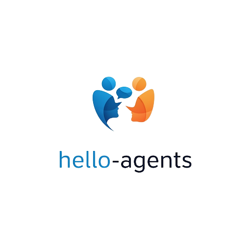

    
    <h1>Hello-Agents</h1>

  
  
  
  

  <h3>🤖 动手学多智能体系统实战教程</h3>
  
<em>从基础理论到实际应用，全面掌握多智能体系统的设计与实现</em>

---

## 🎯 项目介绍

&emsp;&emsp;如果说2023年是"百模大战"的元年，那么2024年无疑开启了"Agent元年"。技术的焦点正从训练更大的基础模型，转向构建更聪明的智能体应用。然而，当前系统性、重实践的教程却极度匮乏。为此，我们发起了 Hello-Agents 项目，希望能为社区提供一本从零开始、理论与实战并重的多智能体系统构建指南。

&emsp;&emsp;Hello-Agents 是一个**系统性的多智能体学习教程**，旨在"授人以渔"。教程将带领你穿透框架表象，从智能体的核心原理出发，深入其核心架构，理解其经典范式，并最终亲手构建起属于自己的、强大的多智能体应用。我们相信，最好的学习方式就是动手实践。希望这本书能成为你探索智能体浩瀚世界的起点，帮助你从一名 LLM 的"使用者"，蜕变为一名智能系统的"构建者"。

### ✨ 你将收获什么？

- 📖 **Datawhale 开源免费** 完全免费学习本项目所有内容，与社区共同成长
- 🔍 **理解核心原理** 深入理解智能体（Agent）的构件、原则与经典范式
- 🏗️ **亲手实现** 编码复现 ReAct、Plan-and-Solve 等经典智能体架构
- 🛠️ **掌握高级技能** 学习并应用 CoT、RAG、工具使用等前沿技术
- 🤝 **构建多智能体** 掌握多智能体协作、通信与评估的核心方法
- 🚀 **驱动真实案例** 实战开发智能旅行助手、自动化研究员等综合项目"

## 📖 内容导航

| 章节 | 关键内容 | 状态 |
| --- | --- | --- |
| [前言](./前言.md) | 项目的缘起、背景及读者建议 | ✅ |
| **第一部分：智能体与语言模型基础** |  |  |
| [第一章 初识智能体](./chapter1/第一章%20初识智能体.md) | 智能体定义、类型、范式与应用 | ✅ |
| [第二章 智能体发展史](./chapter2/第二章%20智能体发展史.md) | 从符号主义到 LLM 驱动的智能体演进 | ✅ |
| [第三章 大语言模型基础](./chapter3/第三章%20大语言模型基础.md) | Transformer、提示、主流LLM及其局限 | ✅ |
| **第二部分：构建你的大语言模型智能体** |  |  |
| [第四章 智能体的核心构件](./chapter4/第四章%20智能体的核心构件.md) | 设计原则、核心能力、记忆与工具 | 🚧 |
| [第五章 智能体经典构建范式](./chapter5/第五章%20智能体经典构建范式.md) | 手把手实现 ReAct, Plan-and-Solve, Reflection | 🚧 |
| [第六章 框架开发实践](./chapter6/第六章%20框架开发实践.md) | CAMEL, LangChain, AutoGen 等主流框架应用 | 🚧 |
| **第三部分：高级知识扩展** |  |  |
| [第七章 推理与规划](./chapter7/第七章%20推理与规划.md) | CoT, 逻辑推理, 搜索与规划 | 🚧 |
| [第八章 记忆与工具](./chapter8/第八章%20记忆与工具.md) | RAG, 向量数据库, API 调用 | 🚧 |
| [第九章 智能体通信协议](./chapter9/第九章%20智能体通信协议.md) | MCP, A2A, ANP 等协议解析 | 🚧 |
| [第十章 多智能体系统](./chapter10/第十章%20多智能体系统.md) | 协作、通信、博弈论与 AI Society | 🚧 |
| [第十一章 智能体性能评估](./chapter11/第十一章%20智能体性能评估.md) | 核心指标、基准测试与评估框架 | 🚧 |
| **第四部分：综合案例进阶** |  |  |
| [第十二章 智能旅行助手](./chapter12/第十二章%20智能旅行助手.md) | RAG与多智能体协作的真实世界应用 | 🚧 |
| [第十三章 自动化深度研究智能体](./chapter13/第十三章%20自动化深度研究智能体.md) | DeepResearch Agent 复现与解析 | 🚧 |
| [第十六章 构建你的赛博小镇](./chapter16/第十六章%20构建你的赛博小镇.md) | Agent 与游戏的结合，模拟社会动态 | 🚧 |
| [第十七章 伦理、对齐与安全](./chapter16/第十六章%20伦理、对齐与安全.md) | Agent 伦理、对齐与安全的讨论 | 🚧 |
| **第五部分：毕业设计及未来展望** |  |  |
| [第十八章 毕业设计](./chapter18/第十八章%20毕业设计.md) | 构建属于你的完整多智能体应用 | 🚧 |
| [第十九章 未来已来](./chapter19/第十九章%20未来已来.md) | 具身智能、人机协作、挑战与机遇 | � |

### 社区贡献精选 (Community Blog)

&emsp;&emsp;欢迎大家将在学习 Hello-Agents 或 Agent 相关技术中的独到见解、实践总结，以 PR 的形式贡献到社区精选。

**暂无内容，期待你的第一次贡献！**

### PDF 版本下载

&emsp;&emsp;***本 Hello-Agents PDF 教程完全开源免费。为防止各类营销号加水印后贩卖给多智能体系统初学者，我们特地在 PDF 文件中预先添加了不影响阅读的 Datawhale 开源标志水印，敬请谅解～***

> *Hello-Agents PDF : https://github.com/datawhalechina/Hello-Agents/releases/tag/PDF*  
> *Hello-Agents PDF 国内下载地址 : https://www.datawhale.cn/learn/summary/XXX* 

## 💡 如何学习

&emsp;&emsp;欢迎你，未来的智能系统构建者！在开启这段激动人心的旅程之前，请允许我们给你一些清晰的指引。

&emsp;&emsp;本书内容兼顾理论与实战，旨在帮助你系统性地掌握从单个智能体到多智能体系统的设计与开发全流程。因此，本书尤其适合有一定编程基础的 **AI开发者、软件工程师、在校学生** 以及对前沿 AI 技术抱有浓厚兴趣的 **自学者**。在阅读本书之前，我们希望你具备扎实的 **Python 编程能力**，并对大语言模型有基本的概念性了解（例如，知道如何通过 API 调用一个 LLM）。本书的重点是 **应用与构建**，因此你无需具备深厚的算法或模型训练背景。

&emsp;&emsp;本书分为五大部分，每一部分都是通往下一阶段的坚实阶梯：

- **第一部分：基础知识**（第1章～第3章），我们将从智能体的定义、类型与发展历史讲起，为你梳理"智能体"这一概念的来龙去脉。随后，我们会快速回顾大语言模型的核心知识，确保你拥有继续前行所需的全部理论基础。

- **第二部分：构建你的大语言模型智能体**（第4章～第6章），这是你动手实践的开始。我们将深入剖析智能体的核心构件，并带你亲手编码实现 ReAct、Plan-and-Solve、Reflection 等经典构建范式。最后，我们会介绍 CAMEL 等业界主流的智能体开发框架，让你兼具"造轮子"和"用轮子"的能力。

- **第三部分：高级知识扩展**（第7章～第11章），在这一部分，你的智能体将"学会"高级技能。我们将探讨思维链（CoT）等推理规划技术，通过检索增强生成（RAG）赋予智能体记忆与工具使用能力，并学习多智能体间的通信协议。最终，你将掌握构建与评估一个完整多智能体系统的方法。

- **第四部分：综合案例进阶**（第12章～第17章），这是本书的实战核心。你将把所学知识融会贯通，构建 **智能旅行助手、自动化深度研究智能体、赛博小镇（Agent+游戏）** 等贴近真实应用场景的复杂项目。此外，我们还提供了关于强化学习、监督微调、伦理安全等可选章节，供你进一步探索。

- **第五部分：毕业设计及未来展望**（第18章～第19章），在旅程的终点，你将完成一个毕业设计，全面检验你的学习成果。我们还将与你一同展望具身智能、人机协作等未来趋势，并探讨多智能体系统带来的机遇与挑战。

&emsp;&emsp;为了获得最佳的学习效果，我们强烈建议你 **将理论与实践相结合**。智能体是一个飞速发展且极度依赖实践的领域。请务必亲手运行、调试甚至修改本书提供的每一份代码。当遇到问题时，欢迎你随时在我们的开源社区中提问和交流。

## 🤝 如何贡献

我们是一个开放的开源社区，欢迎任何形式的贡献！

- 🐛 **报告 Bug** - 发现内容或代码问题，请提交 Issue
- 💡 **提出建议** - 对项目有好想法，欢迎发起讨论
- 📝 **完善内容** - 帮助改进教程，提交你的 Pull Request
- ✍️ **分享实践** - 在"社区贡献精选"中分享你的学习笔记和项目

## 🙏 致谢

### 核心贡献者
- [陈思州-项目负责人](https://github.com/jjyaoao) (Datawhale成员)
- [孙韬-项目负责人](https://github.com/fengju0213) (Datawhale精英助教)  
- [姜舒凡-项目负责人](https://github.com/Tsumugii24)（Datawhale成员）

### 特别感谢
- 感谢 [@Sm1les](https://github.com/Sm1les) 对本项目的帮助与支持
- 感谢所有为本项目做出贡献的开发者们 ❤️

  

## Star History

    

  
⭐ 如果这个项目对你有帮助，请给我们一个 Star！

## 关于 Datawhale

    
    
扫描二维码关注 Datawhale 公众号，获取更多优质开源内容

---

## 📜 开源协议

本作品采用[知识共享署名-非商业性使用-相同方式共享 4.0 国际许可协议](http://creativecommons.org/licenses/by-nc-sa/4.0/)进行许可。
