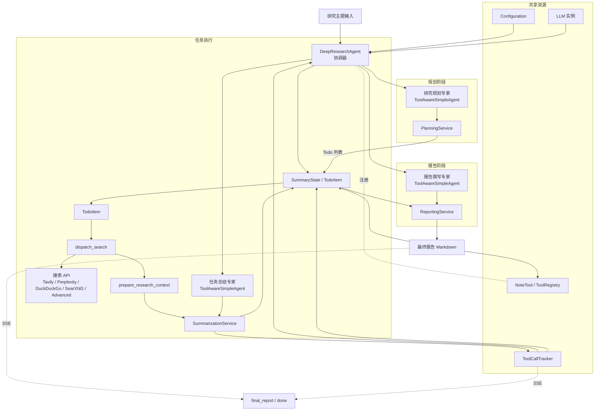

# 第十四章 自动化深度研究智能体

在第十三章的旅行助手项目中，我们体验了如何将HelloAgents应用于一个复杂但闭环的多智能体产品。本章我们继续向前，聚焦「知识密集型应用」：
<strong>构建一个能够自动化执行深度研究任务的智能体体系。</strong>

相比旅行规划，深度研究的难点在于信息的不断发散、事实的快速更新以及用户对引用来源的高要求。为了交付可信的研究报告，我们需要让智能体具备三个核心能力：

<strong>（1）问题剖析</strong>：将用户的开放主题拆解为可检索的查询语句。

<strong>（2）多轮信息采集</strong>：结合不同搜索API持续挖掘资料，并去重整合。

<strong>（3）反思与总结</strong>：依据阶段结果识别知识空白，决定是否继续检索，并生成结构化总结。

本章的目标是带你深入理解 `helloagents-deepresearch` 项目，掌握其架构、运行方式与扩展技巧，最终能够独立运营一套本地可控的研究助手。


## 14.1 项目概述与场景定位

### 14.1.1 为什么需要自动化深度研究智能体

当话题复杂且信息分散时，单纯依赖搜索引擎难以获得结构化洞见。常见的痛点包括：

- 信息碎片化：结果散落在不同站点，需要手动筛选、比对可靠性。
- 维度不平衡：容易沉迷于同类观点，忽略实现细节、对比数据或最新进展。
- 时间成本高：人工整理引用、撰写总结耗时，且难以复盘全过程。

自动化深度研究智能体的优势在于它能够：

- 以智能体循环执行「生成查询→检索→总结→反思」流程，保证主题覆盖度。
- 在本地运行（Ollama、LMStudio），保护敏感主题，同时避免外部服务波动。
- 输出带引用的Markdown报告，便于复盘、分享与二次编辑。

### 14.1.2 整体能力与用户价值

`helloagents-deepresearch` 项目将后端HelloAgents智能体、HelloAgents 内置工具体系与前端可视化界面结合，形成「输入主题→实时观察→获取总结」的闭环体验。整体亮点如下：

- <strong>多提供者模型接入</strong>：支持 Ollama、LMStudio，或通过 `LLM_PROVIDER=custom` 自定义任意 OpenAI 兼容服务，自主选择推理能力与成本。
- <strong>多搜索源融合</strong>：直接复用 HelloAgents 的 `SearchTool`，内置 Tavily、SerpApi、DuckDuckGo、SearXNG、Perplexity 以及高级混合策略，可按需切换。
- <strong>流式反馈</strong>：后端通过 Server-Sent Events 推送各阶段结果，前端即时展示时间线、最新来源和逐字更新的总结。
- <strong>配置优先级清晰</strong>：环境变量、代码默认值分层管理，方便调试与部署。
系统采用经典的<strong>前后端分离架构</strong>，分为四个层次，如图14.1所示

```mermaid
graph LR
  U((用户))
  subgraph FE[前端（Vue 3 + TypeScript）]
    UI[App.vue 研究界面]
    FEAPI[services/api.ts\nrunResearchStream]
  end
  subgraph BE[后端（FastAPI DeepResearcher）]
    API[/POST /research + /research/stream/]
    Config[Configuration.from_env]
    subgraph Workflow[DeepResearchAgent 工作流]
      Planner{{PlanningService\n任务规划}}
      Search{{dispatch_search\n(SearchTool)}}
      Summarizer{{SummarizationService\n任务总结}}
      Reporter{{ReportingService\n报告整合}}
      Tracker[[ToolCallTracker\n工具事件]]
    end
  end
  subgraph LLMTools[LLM + 工具层]
    LLM[(HelloAgentsLLM)]
    NoteTool[(NoteTool\nToolRegistry)]
  end
  subgraph External[外部依赖]
    SearchAPI[(HelloAgents SearchTool\nTavily · SerpApi · DuckDuckGo ·\nSearXNG · Perplexity · Advanced)]
    Notes[(本地笔记\nnotes_workspace)]
  end

  U -->|交互| UI
  UI -->|提交 topic/search_api| FEAPI
  FEAPI -->|POST 请求| API
  API -->|构建配置| Config
  Config -->|实例化| Workflow
  Workflow -->|加载模型| LLM
  Workflow -->|注册工具| NoteTool
  LLM --> Planner
  LLM --> Summarizer
  LLM --> Reporter
  Planner -->|TODO 列表| Workflow
  Workflow -->|SSE todo_list| API
  Workflow --> Search
  Search -->|调用| SearchAPI
  SearchAPI --> Search
  Search --> Summarizer
  Summarizer -->|摘要片段| Workflow
  Planner --> Tracker
  Summarizer --> Tracker
  Reporter --> Tracker
  NoteTool --> Tracker
  NoteTool -->|读写| Notes
  Notes --> NoteTool
  Workflow --> Reporter
  Reporter -->|最终报告| Workflow
  Workflow -->|final_report/done SSE| API
  Tracker -->|tool_call SSE| API
  API -->|Server-Sent Events| FEAPI
  FEAPI -->|更新状态/日志| UI
  UI -->|结果呈现| U
```

图14.1 整体架构图

下一节我们会详细拆解技术架构与数据流转，理解智能体在每一轮循环中的决策与协作方式。

## 14.2 技术架构与流程

### 14.2.1 智能体循环的核心机制

`helloagents-deepresearch` 的核心仍然是 `DeepResearchAgent`，但它不再让单个智能体“单线程”执行所有步骤，而是复用前几章学到的能力组合成一个协作团队：

- <strong>研究规划专家</strong>（`PlanningService` 驱动的 `ToolAwareSimpleAgent`）——由第七章扩展过的 SimpleAgent 模板派生，专门负责把主题拆解成结构化任务。
- <strong>任务总结专家</strong>（`SummarizationService`）——在每个任务的上下文就绪后撰写总结，并通过第九章的 `NoteTool` 进行笔记读写。
- <strong>报告撰写专家</strong>（`ReportingService`）——整合所有任务笔记，产出最终报告并落盘。

三位专家共享同一套工具注册表，其中既包括我们在第七章实现的多源搜索工具，也包括第九章整合的笔记管理能力。

新版 `DeepResearchAgent` 的执行顺序如下：

1. `PlanningService` 启动「研究规划专家」，由模型一次性列出 3~5 条任务，每条任务都会绑定唯一的 `task_id`、笔记标签与 `stream_token`。
2. `run_stream` 为每条任务创建后台线程，线程内部依次完成搜索、总结、笔记写入，并通过队列把 SSE 事件推回主线程。
3. `ReportingService` 等待所有任务完成后，再触发「报告撰写专家」，生成最终 Markdown 并固化到结论笔记中。

以下代码片段（`backend/src/deep_researcher/app/agents/deep_research_agent.py:126` 起）展示了并行执行的核心结构：

```python
channel_map = {task.id: {"step": index, "token": f"task_{task.id}"}
               for index, task in enumerate(state.todo_items, start=1)}

def worker(task: TodoItem, step: int) -> None:
    try:
        enqueue({
            "type": "task_status",
            "task_id": task.id,
            "status": "in_progress",
            "title": task.title,
        })
        for event in self._execute_task(state, task, emit_stream=True, step=step):
            enqueue(event)
    finally:
        enqueue({"type": "__task_done__", "task_id": task.id})

threads = [Thread(target=worker, args=(task, channel_map[task.id]["step"]))
           for task in state.todo_items]
for thread in threads:
    thread.start()
```

`enqueue` 会自动补全 `step`、`stream_token` 等字段，保证前端可以按任务维度渲染事件。得益于这种结构，多个任务可以同时检索、总结，再通过主线程串行输出，既不会丢事件，也避免了线程安全问题。

下图给出了各智能体协同完成研究流程的职责分层与数据流向（图14.2）：



图14.2 Agents架构图


### 14.2.2 后端组件与配置流

深度研究智能体通过 FastAPI 暴露 `/research` 与 `/research/stream` 接口，主要模块如下（文件均位于 `backend/src/deep_researcher/app/` 下）：

- `agents/deep_research_agent.py`：顶层协调者，负责任务规划、并行执行与报告沉淀。
- `services/planner_service.py`、`summarization_service.py`、`reporting_service.py`：分别封装计划、总结、报告逻辑，内部都复用了 `ToolAwareSimpleAgent`。
- `services/tool_events.py`：跟踪 `note` 工具调用，把事件转换成 SSE，可见第九章 `NoteTool` 的集成成果。
- `services/search_service.py`：作为 HelloAgents `SearchTool` 的薄包装，将结构化搜索结果与上下文整理给下游 Agent。
- `configuration.py`、`api.py`：负责配置加载、HelloAgentsLLM 初始化与 HTTP 层的流式推送。

数据流转顺序为：

1. 前端提交主题、迭代次数、搜索 API（可选）。
2. FastAPI 解析请求，合并配置并实例化 `DeepResearchAgent`。
3. 智能体并行执行所有任务，并持续通过 SSE 推送 `tool_call`、`task_summary_chunk`、`sources`、`report_note` 等事件。
4. 客户端结束时收到携带 `note_id` 的 `final_report` 与 `done` 事件，可直接展示、跳转或二次编辑。

```python
class Configuration(BaseModel):
    max_web_research_loops: int = Field(default=3)
    local_llm: str = Field(default="llama3.2")
    llm_provider: str = Field(default="ollama")
    search_api: SearchAPI = Field(default=SearchAPI.DUCKDUCKGO)
    enable_notes: bool = Field(default=True)
    notes_workspace: str = Field(default="./notes/deep_research")
    fetch_full_page: bool = Field(default=True)
    ollama_base_url: str = Field(default="http://localhost:11434")
    lmstudio_base_url: str = Field(default="http://localhost:1234/v1")
    strip_thinking_tokens: bool = Field(default=True)
    use_tool_calling: bool = Field(default=False)
    llm_api_key: Optional[str] = None
    llm_base_url: Optional[str] = None
    llm_model_id: Optional[str] = None

    @classmethod
    def from_env(cls, overrides: Optional[dict[str, Any]] = None) -> "Configuration":
        raw_values: dict[str, Any] = {}

        for field_name in cls.model_fields.keys():
            env_key = field_name.upper()
            if env_key in os.environ:
                raw_values[field_name] = os.environ[env_key]

        env_aliases = {
            "local_llm": os.getenv("LOCAL_LLM"),
            "llm_provider": os.getenv("LLM_PROVIDER"),
            "llm_api_key": os.getenv("LLM_API_KEY"),
            "llm_model_id": os.getenv("LLM_MODEL_ID"),
            "llm_base_url": os.getenv("LLM_BASE_URL"),
            "lmstudio_base_url": os.getenv("LMSTUDIO_BASE_URL"),
            "ollama_base_url": os.getenv("OLLAMA_BASE_URL"),
            "max_web_research_loops": os.getenv("MAX_WEB_RESEARCH_LOOPS"),
            "fetch_full_page": os.getenv("FETCH_FULL_PAGE"),
            "strip_thinking_tokens": os.getenv("STRIP_THINKING_TOKENS"),
            "use_tool_calling": os.getenv("USE_TOOL_CALLING"),
            "search_api": os.getenv("SEARCH_API"),
            "enable_notes": os.getenv("ENABLE_NOTES"),
            "notes_workspace": os.getenv("NOTES_WORKSPACE"),
        }

        for key, value in env_aliases.items():
            if value is not None:
                raw_values.setdefault(key, value)

        if overrides:
            for key, value in overrides.items():
                if value is not None:
                    raw_values[key] = value

        return cls(**raw_values)
```

配置解析逻辑（`backend/src/deep_researcher/configuration.py:18`）先读取所有大写环境变量，再应用显式别名，最后才合并 API 请求的覆盖值。需要注意的是，从本章起 HelloAgents 原生 `HelloAgentsLLM` 已支持 `LLM_PROVIDER=custom`：只要同时提供 `LLM_BASE_URL` 与 `LLM_API_KEY` 即可连接任意 OpenAI 兼容服务，而 `LOCAL_LLM`/`OLLAMA_BASE_URL` 等字段继续服务于本地模型场景。实际运行时意味着：

- `.env` 或系统环境变量拥有最高优先级，便于本地调试和生产部署。
- LangGraph/UI 提交的临时参数通过 `overrides` 注入，不会修改全局环境。
- 字段均由 Pydantic 校验，错误值会在启动阶段被捕获，避免无效配置导致的运行时故障。

### 14.2.3 自定义多源搜索工具

为了适应不同团队的检索与合规要求，本项目直接复用 HelloAgents 框架的 `SearchTool`。这一工具现已支持 Tavily、SerpApi、DuckDuckGo、SearXNG、Perplexity 以及「advanced」混合策略，并且同一份结构化返回可以被多个 Agent 共享。因此在深度研究项目里，我们只需要按需配置即可：

1. **选择后端**：将 `SEARCH_API` 设为 `tavily`、`serpapi`、`duckduckgo`、`searxng`、`perplexity` 或 `advanced`。其中 `hybrid` 与 `advanced` 等价，都会优先尝试 Tavily/SerpApi，再降级到 DuckDuckGo。
2. **配置密钥**：根据选定后端设置 `TAVILY_API_KEY`、`SERPAPI_API_KEY`、`PERPLEXITY_API_KEY` 等环境变量；若只想使用无密钥的 DuckDuckGo/SearXNG，可不设置。
3. **结构化输出**：`SearchTool` 默认返回友好的文本描述，当我们在 `services/search_service.py` 中传入 `mode=structured` 时，会得到统一的 `{"results": [...], "answer": ..., "notices": [...]}` 结构，方便后续做去重、裁剪、引用。
4. **深度定制（可选）**：如果还需要扩展新的搜索后端，可以在 HelloAgents 仓库内直接继承 `SearchTool` 并覆盖 `_search_xxx` 方法，或者提交 PR 将新后端合入框架。由于深度研究项目只是框架的“薄封装”，一旦上游合并，所有下游应用都会自动获得能力升级。

这种设计让学习者无需在项目中维护额外的搜索适配器，即可通过配置或框架升级获得最新能力；同时也保留了在企业环境内扩展私有搜索源的灵活度。

> 提示：配置项 `ENABLE_NOTES` 默认为 `true`。当启用时，后端会为每个任务自动同步一份 Markdown 笔记（目录由 `NOTES_WORKSPACE` 指定），并把 `note` 工具挂载到所有 Agent，方便它们在需要时对笔记做增删改查。流式事件会附带 `note_id`，前端可据此展示或跳转对应笔记。

### 14.2.4 前端交互与流式反馈

前端基于 Vue 3 + Vite，核心页面是 `App.vue`，其职责包括：

- 通过 `runResearchStream` 调用 `/research/stream`，逐条解析 SSE 数据，并依据 `task_id` / `stream_token` 把事件路由到对应任务卡片。
- 监听 `tool_call` 与 `report_note` 事件，实时展示笔记更新与最终报告位置。
- 支持用户在研究进行时主动取消请求（`AbortController`），确保界面响应及时。
- 提供表单化配置入口（迭代次数、搜索引擎选择），与后端的覆盖策略一一对应。

UI 设计强调“实时性”与“可追溯性”：时间线用于说明状态变化，来源列表/历史面板展示引用详情，摘要与报告区域则会在收到 `task_summary_chunk`、`report_note` 等事件时滚动高亮，提示用户关注最新内容。

```typescript
export async function runResearchStream(
  payload: ResearchRequest,
  onEvent: (event: ResearchStreamEvent) => void,
  options: StreamOptions = {}
): Promise<void> {
  const response = await fetch(`${baseURL}/research/stream`, {
    method: "POST",
    headers: {
      "Content-Type": "application/json",
      Accept: "text/event-stream"
    },
    body: JSON.stringify(payload),
    signal: options.signal
  });

  if (!response.ok) {
    const errorText = await response.text().catch(() => "");
    throw new Error(errorText || `研究请求失败，状态码：${response.status}`);
  }

  const body = response.body;
  if (!body) {
    throw new Error("浏览器不支持流式响应，无法获取研究进度");
  }

  const reader = body.getReader();
  const decoder = new TextDecoder("utf-8");
  let buffer = "";

  while (true) {
    const { value, done } = await reader.read();
    buffer += decoder.decode(value || new Uint8Array(), { stream: !done });

    let boundary = buffer.indexOf("\n\n");
    while (boundary !== -1) {
      const rawEvent = buffer.slice(0, boundary).trim();
      buffer = buffer.slice(boundary + 2);

      if (rawEvent.startsWith("data:")) {
        const dataPayload = rawEvent.slice(5).trim();
        if (dataPayload) {
          const event = JSON.parse(dataPayload) as ResearchStreamEvent;
          onEvent(event);

          if (event.type === "error" || event.type === "done") {
            return;
          }
        }
      }

      boundary = buffer.indexOf("\n\n");
    }

    if (done) {
      if (buffer.trim()) {
        const rawEvent = buffer.trim();
        if (rawEvent.startsWith("data:")) {
          const event = JSON.parse(rawEvent.slice(5).trim()) as ResearchStreamEvent;
          onEvent(event);
        }
      }
      break;
    }
  }
}
```

这段 TypeScript 实现（`frontend/src/services/api.ts:1`）通过原生 `ReadableStream` 持续解析 SSE：

- 逐块累积缓冲区并按 `\n\n` 分割事件，兼容浏览器对流式分片的差异化处理。
- 一旦收到 `error` 或 `done` 事件便主动收尾，防止前端挂起。
- 支持传入 `AbortController`，与界面上的“取消研究”按钮形成闭环，用户体验更加可控。


图14.3 UI交互图

## 14.3 快速上手指南

为了在本地体验深度研究智能体，我们建议分三步完成：准备运行环境、配置模型与搜索服务、分别启动后端与前端。以下流程基于 `code/chapter14/helloagents-deepresearch/` 目录。

### 14.3.1 环境要求与依赖安装

- Python ≥ 3.11（后端使用 `pyproject.toml` 配合 `uv` 或 `pip` 安装依赖）
- Node.js ≥ 18.0（建议 20+）与 npm ≥ 9.0
- 至少一种本地大模型服务：Ollama 或 LMStudio或API供应商

推荐使用虚拟环境隔离依赖：

```bash
cd code/chapter14/helloagents-deepresearch/backend
python -m venv .venv
source .venv/bin/activate  
```

随后安装 Python 依赖：

```bash
uv sync  # 若未安装 uv，可先使用pip install uv 来进行安装
```

前端部分进入 `frontend` 目录执行 `npm install` 即可。

### 14.3.2 配置本地模型与搜索服务

后端默认读取同目录下的 `.env` 文件。参考步骤：

```bash
cp .env.example .env
```

根据自身环境设置以下核心变量：

- 模型提供者：`LLM_PROVIDER=ollama`、`LLM_PROVIDER=lmstudio` 或 `LLM_PROVIDER=custom`
- 模型名称：`LOCAL_LLM=deepseek-r1:8b`（Ollama）/`LOCAL_LLM=qwen_qwq-32b`（LMStudio）或云端场景下的 `LLM_MODEL_ID`
- 服务地址：`OLLAMA_BASE_URL`、`LMSTUDIO_BASE_URL` 或通用 `LLM_BASE_URL`
- 是否开启工具调用：`USE_TOOL_CALLING=true`
- 搜索服务：`SEARCH_API=duckduckgo`、`tavily`、`perplexity`、`searxng`

若选择 Tavily、Perplexity 或自建 SearXNG，请额外填写对应的 `TAVILY_API_KEY`、`PERPLEXITY_API_KEY` 或 `SEARXNG_URL`。

```bash
# backend/.env 示例片段
SEARCH_API='duckduckgo'
LLM_PROVIDER=custom
LLM_MODEL_ID=your-model-name
LLM_API_KEY=your-api-key-here
LLM_BASE_URL=your-api-base-url
USE_TOOL_CALLING=true
MAX_WEB_RESEARCH_LOOPS=3
FETCH_FULL_PAGE=True
# 切换至本地模型时，只需启用以下注释行：
# LLM_PROVIDER=ollama
# LOCAL_LLM=llama3.2
# OLLAMA_BASE_URL=http://localhost:11434
```

如 `.env.example` 所示（`backend/.env.example`），云端、自建、本地三种配置都以注释形式保留。保持模板不删，有助于在不同部署模式间快速切换。
以下是调用 SiliconFlow API 作为大模型服务的示例环境配置：


### 14.3.3 启动后端服务

后端以 FastAPI 形式提供 HTTP API 与 SSE 流接口。启动方式：

```bash
cd code/chapter14/helloagents-deepresearch/backend
uv run uvicorn deep_researcher.api:app --reload
```

成功后可访问 `http://localhost:8000/docs` 查看自动生成的 OpenAPI 文档，验证 `/research` 与 `/research/stream` 接口是否可用。


### 14.3.4 启动前端与联调

前端基于 Vite，默认通过 `.env` 或命令行指定后端地址：

```bash
cd code/chapter14/helloagents-deepresearch/frontend
echo "VITE_API_BASE_URL=http://localhost:8000" > .env.local  # 可选
npm run dev
```

浏览器访问 `http://localhost:5173`，输入研究主题即可观察到流式时间线、来源列表和逐渐成型的总结。若需要部署或静态打包，可使用 `npm run build` 并将输出托管至任意静态服务器，注意同步配置 `VITE_API_BASE_URL`。

完成以上步骤后，一个全流程的深度研究助手便可以在本地运行。接下来我们将深入拆解关键模块的实现细节，理解为何它能稳定输出结构化的研究结果。

## 14.4 关键模块拆解

从代码角度理解核心模块，有助于在后续扩展或排查问题时做到心中有数。本节按流程拆解查询生成、搜索适配、总结与反思逻辑，以及流式通信协议。

### 14.4.1 任务规划：SimpleAgent 的再利用

`PlanningService` 把第七章的 `SimpleAgent` 模板直接升级为多任务规划器。通过 `ToolAwareSimpleAgent` 的 `run` 方法，我们既继承了原有的 Prompt 能力，也让模型得以调用 `note` 工具记录任务框架。

```python
def plan_todo_list(self, state: SummaryState) -> List[TodoItem]:
    prompt = todo_planner_instructions.format(
        current_date=get_current_date(),
        research_topic=state.research_topic,
    )

    response = self._agent.run(prompt)
    self._agent.clear_history()

    tasks_payload = self._extract_tasks(response)
    todo_items: List[TodoItem] = []

    for idx, item in enumerate(tasks_payload, start=1):
        task = TodoItem(
            id=idx,
            title=str(item.get("title") or f"任务{idx}").strip(),
            intent=str(item.get("intent") or "聚焦主题的关键问题").strip(),
            query=str(item.get("query") or state.research_topic).strip(),
        )
        todo_items.append(task)

    state.todo_items = todo_items
    return todo_items
```

（`backend/src/deep_researcher/app/services/planner_service.py:26`）

`_extract_tasks` 优先解析 JSON，再兼容 `[TOOL_CALL:note:{...}]` 形式，这与我们在第九章使用 `NoteTool` 的方式完全一致：模型既可以一次输出结构化数组，也可以显式调用工具创建任务笔记。规划阶段只负责生成骨架，笔记的后续更新会在每个任务线程中完成。

### 14.4.2 搜索执行与上下文整合

`search_service.dispatch_search` 把第七章的高级搜索工具纳入统一接口。无论是内置的 DuckDuckGo/Tavily，还是我们自定义的 `advanced` 工具（复用 `code/chapter7/my_advanced_search.py`），最终都会被整理成 `{"results": [...], "notices": [...]}` 的结构。随后 `prepare_research_context` 会调用 `deduplicate_and_format_sources`，去除重复 URL 并裁剪正文长度，确保总结阶段的上下文既全面又精简。

```python
search_result, notices, answer_text, backend = dispatch_search(
    task.query,
    self.config,
    state.research_loop_count,
)

sources_summary, context = prepare_research_context(
    search_result,
    answer_text,
    self.config,
)
```

（`backend/src/deep_researcher/app/agents/deep_research_agent.py:261`）

正因为我们在第七章就把搜索工具封装成可复用的注册表，现在只需切换 `SEARCH_API=advanced`，`dispatch_search` 就会自动调用自定义工具，并把降级信息通过 `notices` 推送到前端，让用户随时了解当前轮次是否触发了兜底策略。

### 14.4.3 并行总结与流式输出

总结阶段同样依赖 `ToolAwareSimpleAgent`，但我们重写了 `stream_run` 以支持在流式输出中执行工具：

```python
for chunk in self.llm.stream_invoke(messages, **kwargs):
    residual += chunk
    for segment in process_residual():
        if not segment:
            continue
        segments_this_round.append(segment)
        final_segments.append(segment)
        yield segment

for call_text in tool_call_texts:
    tool_calls.extend(self._parse_tool_calls(call_text))

if tool_calls:
    messages.append({"role": "assistant", "content": clean_response})
    tool_results_text = "\n\n".join(self._execute_tool_call(...))
    messages.append({"role": "user", "content": "工具执行结果：\n..."})
```

（`backend/src/deep_researcher/app/agents/tool_aware_agent.py:243`）

`process_residual` 会截断尚未完整输出的 `[TOOL_CALL:...]` 片段，确保前端永远不会看到残缺的工具指令；一旦工具执行完成，新的上下文会立即写回消息栈，继续下一轮对话。配合 `SummarizationService.stream_task_summary`，我们可以在前端实时看到任务总结的增量内容，并且在总结结束后自动拿到最终文本。

### 14.4.4 笔记同步与报告沉淀

`ToolCallTracker` 记录所有笔记相关事件，并在任务线程之间同步 `note_id`。当所有任务完成后，`_persist_final_report` 会把最终 Markdown 写入结论笔记：若已有同名笔记则更新，否则创建新笔记并返回 `report_note` 事件。

```python
payload = {
    "type": "report_note",
    "note_id": note_id,
    "title": note_title,
    "content": content,
    "note_path": str(note_path),
}

yield {
    "type": "final_report",
    "report": report,
    "note_id": state.report_note_id,
    "note_path": state.report_note_path,
}
```

（`backend/src/deep_researcher/app/agents/deep_research_agent.py:248`）

这意味着前端可以在报告区域直接显示笔记路径，甚至提供“一键打开 Markdown” 的快捷入口；而后端的数据结构中也会记录 `report_note_id`，便于二次加工或测试校验。

### 14.4.5 SSE 事件协议升级

随着并行化与笔记沉淀的引入，SSE 事件类型也进行了扩展：

- `todo_list`：包含任务清单以及每个任务的 `stream_token`。
- `task_status` / `task_summary_chunk` / `sources`：逐任务输出状态、总结增量与来源摘要。
- `tool_call`：复用第九章的事件格式，记录模型执行 `note` 等工具的详情。
- `report_note`：最终报告落盘后的通知，附带 `note_id`、`note_path` 与正文内容。
- `final_report` / `done`：宣告流程结束，并把最终 Markdown 与笔记信息一起返回。

前端 `runResearchStream` 只需在事件分发器中新增对 `report_note` 的处理，即可在 UI 中同步展示最新笔记。由于每条事件都包含 `task_id` 与 `stream_token`，即使多个任务并行输出，也能稳定位于正确的面板。

掌握以上模块，对于定制 Prompt、扩展企业内部检索源或构建新的可视化界面都有直接帮助。下一节我们将讨论可能的扩展方向与实践建议。
